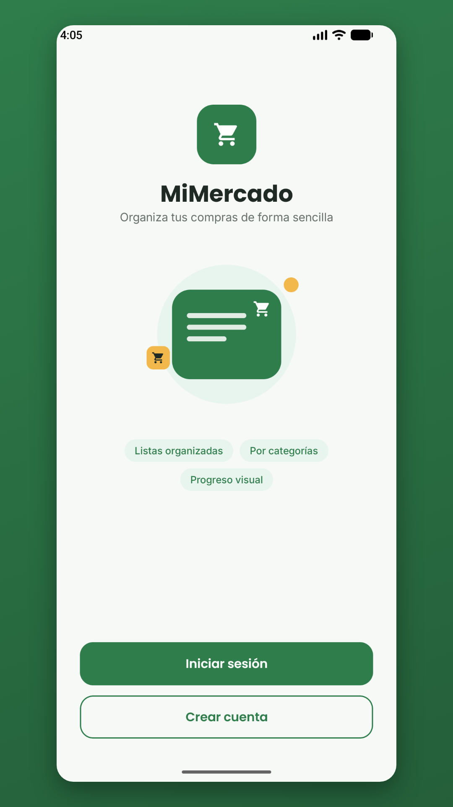
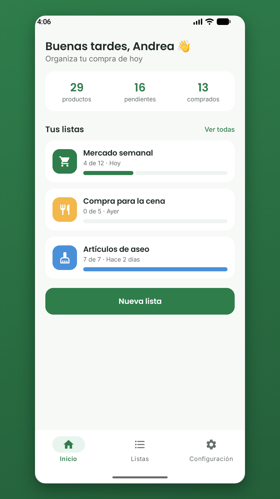
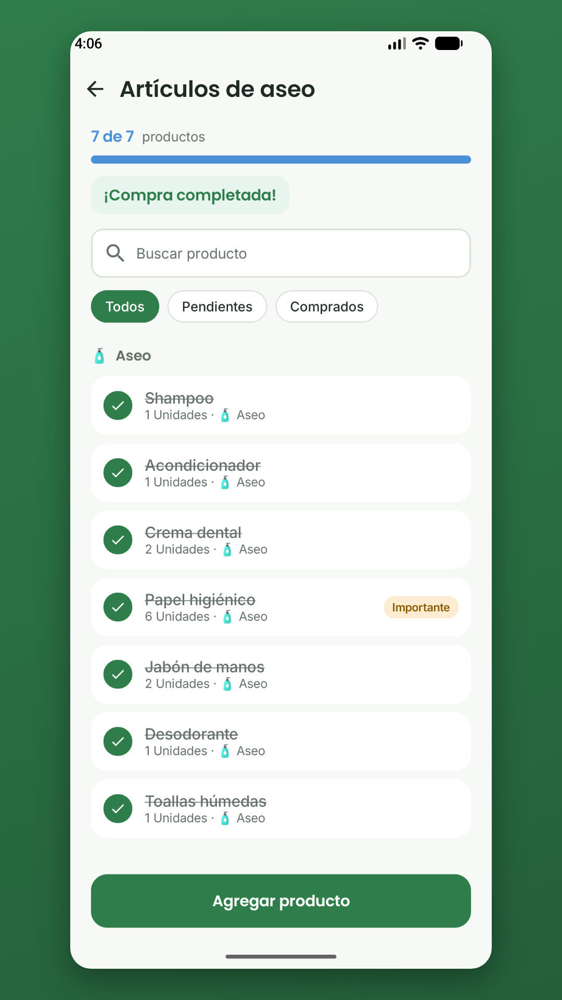

<p align="center">
  
</p>

<h1 align="center">MiMercado</h1>

<p align="center">
  Organiza tus listas de mercado por categorías y marca lo que ya compraste.
</p>

<p align="center">
  
  
  
  
</p>

---

## 📱 Capturas

<p align="center">
  
  
  
</p>

## ✨ Funcionalidades

- **Cuentas de usuario**: registro, inicio de sesión, recuperación de contraseña y eliminación de cuenta.
- **Varias listas**: crea listas (mercado semanal, cena, aseo…) con ícono y color propios.
- **Productos detallados**: cantidad, unidad, categoría, nota y prioridad.
- **Progreso visual**: marca lo comprado y mira el avance de cada lista.
- **Búsqueda y filtros**: busca productos y filtra entre pendientes y comprados.
- **Orden por categoría**: agrupa los productos para recorrer la tienda más rápido.
- **Tema claro, oscuro o del sistema.**
- **Privacidad**: todos los datos se guardan solo en el dispositivo. Sin anuncios, sin rastreo y sin conexión a internet.

## 🛠️ Tecnologías

| Área | Herramienta |
|---|---|
| Lenguaje | Kotlin 2.0 |
| Interfaz | Jetpack Compose + Material 3 |
| Navegación | Navigation Compose |
| Base de datos | Room (SQLite) |
| Preferencias y sesión | DataStore Preferences |
| Concurrencia | Kotlin Coroutines + Flow |
| Arquitectura | MVVM (ViewModel + Repository) |

## 📂 Estructura del repositorio

```
MiMercado/                                  ← raíz del repositorio
├── MiMercado/                              ← proyecto Android (ábrelo en Android Studio)
│   ├── app/
│   │   ├── build.gradle.kts
│   │   ├── proguard-rules.pro
│   │   └── src/main/
│   │       ├── AndroidManifest.xml
│   │       ├── java/co/edu/upb/mimercado/
│   │       │   ├── data/                   # Room (entidades, DAOs, base de datos), repositorio y datos de ejemplo
│   │       │   │   ├── AppDatabase.kt
│   │       │   │   ├── Catalog.kt
│   │       │   │   ├── Daos.kt
│   │       │   │   ├── MercadoRepository.kt
│   │       │   │   ├── Models.kt
│   │       │   │   └── Seed.kt
│   │       │   ├── ui/
│   │       │   │   ├── components/         # Componentes reutilizables (campos, botones, logo…)
│   │       │   │   ├── navigation/         # Rutas y navegación entre pantallas
│   │       │   │   ├── screens/            # Autenticación, listas, productos y configuración
│   │       │   │   └── theme/              # Colores, tipografía y tema
│   │       │   ├── MainActivity.kt
│   │       │   ├── MercadoViewModel.kt
│   │       │   └── MiMercadoApplication.kt
│   │       └── res/
│   │           ├── drawable/               # Ícono de la app (vector)
│   │           ├── font/                   # Poppins e Inter
│   │           ├── mipmap-anydpi-v26/      # Ícono adaptativo
│   │           └── values/                 # Colores, textos y temas
│   ├── gradle/wrapper/
│   ├── build.gradle.kts
│   ├── settings.gradle.kts
│   ├── gradle.properties
│   ├── gradlew
│   └── gradlew.bat
├── WireframesManuales/                     # Wireframes de cada pantalla (PNG, DOCX y PDF)
├── docs/                                   # Ícono y capturas usadas en este README
├── MiMercado_Documento_Diseno_Inicial.docx # Documento de diseño inicial
└── README.md
```

## 🚀 Cómo ejecutarlo

### Requisitos
- Android Studio (versión reciente)
- JDK 17 o 21
- Android SDK 36

### Pasos
1. Clona el repositorio:
   ```bash
   git clone https://github.com/Niscko/MiMercado.git
   ```
2. En Android Studio abre la carpeta interna **`MiMercado/MiMercado`** (la que contiene `settings.gradle.kts`) y espera a que Gradle sincronice.
3. Ejecuta la app en un emulador o celular con Android 8.0 (API 26) o superior.

### Cuenta de prueba
La app incluye una cuenta de demostración con listas de ejemplo:

| Correo | Contraseña |
|---|---|
| `andrea@email.com` | `mercado123` |

## 📐 Diseño

- [Documento de diseño inicial](MiMercado_Documento_Diseno_Inicial.docx)
- [Wireframes manuales (PDF)](WireframesManuales/MiMercado_Wireframes_Manuales.pdf)

<p align="center">
  
</p>

## 📦 Versión de publicación

Para generar el App Bundle firmado (`.aab`) se necesitan el archivo `keystore.properties` y la llave de subida, que **no están en el repositorio** por seguridad. Con esos archivos dentro de `MiMercado/MiMercado/`:

```bash
cd MiMercado
./gradlew bundleRelease
```

El archivo se genera en `MiMercado/app/build/outputs/bundle/release/`.

## 🔒 Privacidad

MiMercado no recopila ni comparte datos. Consulta la [política de privacidad](https://sites.google.com/view/mimercado-privacidad/p%C3%A1gina-principal).

## 👥 Autores

| Integrante |
|---|
| Josue Pino |
| Nicolás Agudelo |

**Universidad Pontificia Bolivariana** · Ingeniería de Sistemas · Aplicaciones Móviles
